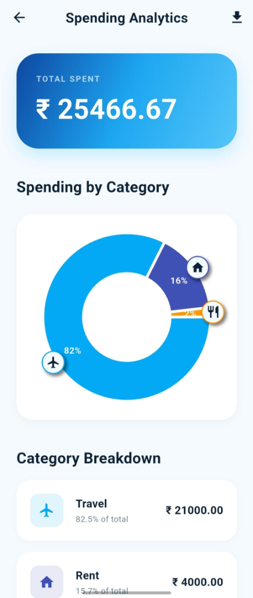
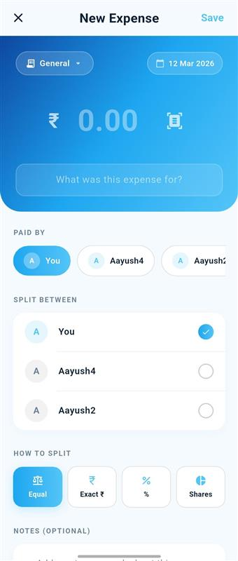
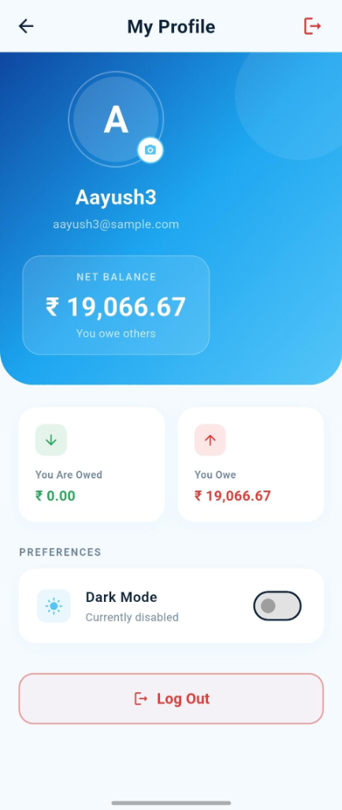
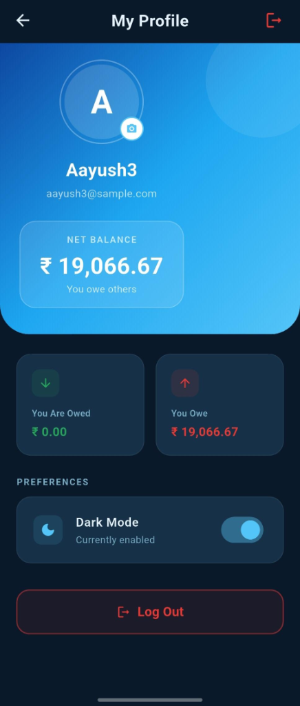

# Muneem Ji - Pro Expense Tracker

Muneem Ji is a powerful, modern expense tracking and split-bill application built with Flutter and Firebase. It empowers users to manage daily expenses, split costs with friends, and gain deep insights into their spending habits through beautiful analytics.

## 📸 App Screenshots

<p align="center">
  
  
  
</p>

<p align="center">
  
  
</p>

## 🚀 Key Features

- **Activity Feed**: Stay updated with a social-style log of all expense additions, edits, and settlements.
- **Commenting System**: Discuss expenses directly within the app to clarify split details.
- **OCR Receipt Scanning**: Save time with on-device text recognition. Simply snap a photo of your receipt to auto-fill amounts!
- **Deep Analytics**: Visualize your spending with interactive charts and category-wise breakdowns.
- **Secure Authentication**: Robust login and signup flow powered by Firebase.
- **Real-time Sync**: Instant data synchronization across devices using Firestore.
- **Group Management**: Create groups for trips, households, or shared events.
- **Cloud Storage**: Seamlessly upload and manage profile photos via Firebase Storage.
- **Smart Settle Up**: Intuitive UI to track who owes whom and settle debts quickly.

## 🏗️ Architecture & Folder Structure

The project follows a clean, modular structure centered around the **Provider** pattern for state management and **Service-based** logic for external interactions:

- 📂 `lib/models/`: Data models (Expense, Group, Activity, Comment, etc.).
- 📂 `lib/providers/`: State management using ChangeNotifiers.
- 📂 `lib/screens/`: UI screens and page-specific widgets.
- 📂 `lib/services/`: Direct interactions with Firebase (Auth, Firestore, Storage).
- 📂 `lib/utils/`: Shared utilities, formatters, and custom splitting algorithms.

## 🛠️ Tech Stack

- **Framework**: Flutter
- **Backend**: Firebase (Auth, Firestore, Storage, FCM)
- **OCR**: Google ML Kit (Text Recognition)
- **Analytics**: Fl Chart
- **State Management**: Provider

## ⚙️ Getting Started

### Prerequisites
- Flutter SDK (latest stable version)
- Android Studio / VS Code
- A Firebase project set up

### Installation
1.  Clone the repository:
    ```bash
    git clone https://github.com/yourusername/muneem-ji.git
    ```
2.  Install dependencies:
    ```bash
    flutter pub get
    ```
3.  Add your `google-services.json` to `android/app/`.
4.  Run the app:
    ```bash
    flutter run
    ```

## 🗺️ Future Roadmap

Planned improvements to make Muneem Ji the best expense manager:
- **Debt Simplification**: Automatically minimize the number of payments required between group members.
- **Complex Splitting**: Support for unequal splits, percentages, and custom shares for advanced scenarios.
- **Recurring Expenses**: Automate monthly bills and subscriptions.
- **Multi-currency Support**: Manage expenses across different regions with live exchange rates.

## 📄 License

**Proprietary / All Rights Reserved**. 

Copyright (c) 2026 Muneem Ji Project. This project is private property. Any unauthorized use, publication, or distribution (including publishing on app stores) is strictly prohibited as per the [LICENSE](LICENSE) file.
